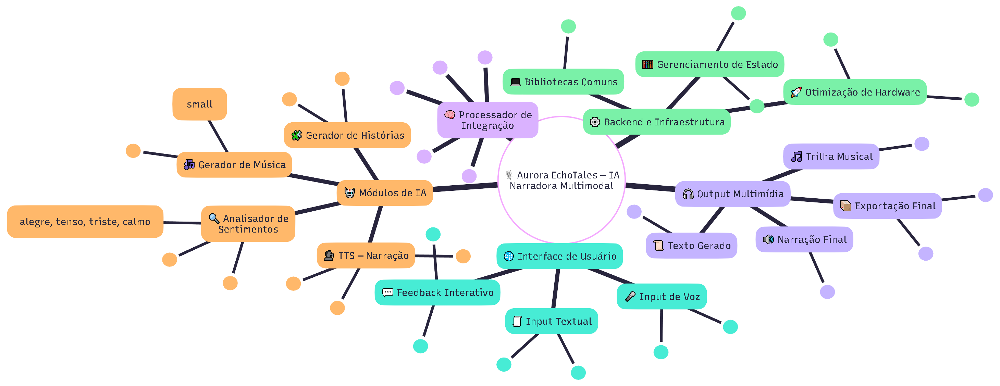

# 🎭 Aurora EchoTales

> **Sistema de Storytelling Multimídia Impulsionado por IA**

Aurora EchoTales é uma aplicação inovadora que combina **geração de histórias**, **análise emocional dual** (texto + áudio), **música procedural** e **narração TTS** para criar experiências narrativas imersivas e emocionalmente ressonantes.



---

## ✨ Features Principais

- 📖 **Geração de Histórias**: Narrativas interativas com **LLaMA 2 7B** (4-bit quantized)
- � **Análise de Emoção Dual**: 
  - Texto: **DistilRoBERTa** (7 emoções)
  - Áudio: **Whisper** (transcrição) + **Emotion2Vec** (emoção - fine-tunning)
- 🎵 **Música Procedural**: **Riffusion** - Geração via prompts textuais adaptados à emoção
- 🎤 **Narração Emocional**: **XTTS** - TTS com suporte nativo a emoções
- 🔄 **Integração Emocional**: Emoções detectadas influenciam música E narração
- 💾 **Otimização de Recursos**: Carregamento sequencial de modelos, VRAM < 5GB

---

## 🏗️ Arquitetura Técnica

### **Stack Tecnológico**

```
Frontend:  React + Vite + TypeScript + Tailwind CSS
    ↓ (REST API + WebSocket)
Backend:   FastAPI (Python 3.10+)
    ↓
Core:      Orchestrator + Model Manager + Emotion Analyzer
    ↓
AI Models: LLaMA 2 | Whisper | Emotion2Vec | DistilRoBERTa | Riffusion | Bark
```

### **Modelos de IA**

| Módulo | Modelo | VRAM | Latência |
|--------|--------|------|----------|
| 📖 Story | LLaMA 2 7B (4-bit) | 5GB | 8-12s |
| 🎙️ STT | Whisper Small | 2GB | 5-10s |
| 😊 Audio Emotion | Emotion2Vec | 1-2GB | 1-3s |
| 📝 Text Emotion | DistilRoBERTa | 0.5GB | <1s |
| 🎵 Music | Riffusion | 3GB | 20-30s |
| 🎤 TTS | XTTS | 2GB | 5-15s |

**Pipeline Total**: 45-77s | VRAM Pico: 4GB ✅

### **Fluxo de Execução**

```
1. Input Processing     → Análise de emoção (texto/áudio)
2. Story Generation     → LLaMA 2 gera narrativa
3. Music Generation     → Riffusion cria trilha adaptada
4. Narration           → Bark narra com emoção
5. Audio Mixing        → Combinação final
6. Output              → História + Áudio completo
```

---

## 💻 Requisitos de Hardware

- **RAM**: 16GB
- **GPU**: NVIDIA RTX 4060 (8GB VRAM)
- **Armazenamento**: ~50GB (modelos + cache)

### **Software**
- **Python**: 3.10 ou 3.11
- **CUDA**: 11.8 ou 12.1
- **Sistema**: Windows 10/11
- **Git**: Para instalação de Bark

---

## 🎮 Uso (Após Implementação)

### **Modo Planejado**

```powershell
# Iniciar backend
uvicorn backend.main:app --reload

# Iniciar frontend (outro terminal)
cd frontend
npm run dev
```

Acesse: http://localhost:5173

---

## 🎯 Inovações e Diferenciais

### **1. Sistema de Emoções Dual**
```
Input Texto → DistilRoBERTa → EmotionVector
                                    ↓
                            [Unificação]
                                    ↓
Input Áudio → Whisper + Emotion2Vec → EmotionVector
                                    ↓
                            [Aplicação]
                                    ↓
        ┌───────────────────┴───────────────────┐
        ▼                                       ▼
    Riffusion                               Bark TTS
(Prompt adaptado)                    (Voice preset + tokens)
```

### **2. Integração Emocional Completa**

**Exemplo**: Emoção "joy" detectada →
- **Música**: "upbeat acoustic guitar, major key, cheerful, 120 bpm"
- **Narração**: Voice preset animado + tokens `[laugh]`

---

## 📁 Estrutura do Projeto

```
AuroraEchoTales/
├── 📚 Documentação
│   ├── INDEX.md                    # Índice mestre
│   ├── BACKEND_PLANNING.md         # ⭐ Sumário executivo
│   ├── DECISIONS.md                # Decisões finalizadas
│   ├── ROADMAP.md                  # Timeline
│   ├── VALIDATION_PLAN.md          # Plano de testes
│   └── docs/
│       └── ARCHITECTURE.md         # Arquitetura técnica
│
├── 🧪 Validação
│   ├── requirements-validation.txt
│   └── tests/validation/
│       ├── README.md               # Guia de testes
│       ├── check_environment.py
│       ├── test_*.py              # Scripts de teste
│       └── utils.py
│
├── 🔧 Backend (A Implementar)
│   └── backend/
│       ├── core/
│       │   ├── model_manager.py
│       │   ├── emotion_analyzer.py
│       │   └── orchestrator.py
│       ├── models/
│       │   ├── story_generator.py
│       │   ├── audio_analyzer.py
│       │   ├── music_generator.py
│       │   └── tts_narrator.py
│       ├── api/
│       │   └── routes/
│       └── main.py
│
├── 💻 Frontend
│   └── frontend/
│       └── src/
│
├── 📦 Cache e Output
│   ├── cache/                      # Modelos baixados
│   ├── output/                     # Outputs gerados
│   └── logs/                       # Logs de execução
│
└── 🗂️ Arquivos Antigos
    └── backend.old/                # Backend anterior (referência)
```

---

## 🛠️ Otimizações Técnicas

### **1. Quantização 4-bit (BitsAndBytes)**
```python
BitsAndBytesConfig(
    load_in_4bit=True,
    bnb_4bit_compute_dtype=torch.float16,
    bnb_4bit_use_double_quant=True
)
```
- Reduz VRAM em ~75% (7GB → 3.5GB para LLaMA 2)
- Mantém 95%+ da qualidade original

### **2. Processamento Sequencial**
```python
# Load → Use → Cleanup → Next
with model_manager.load("llama2"):
    # Usa 3.5GB
    story = generate_story()
torch.cuda.empty_cache()  # Libera

with model_manager.load("riffusion"):
    # Reutiliza os mesmos 3GB
    music = generate_music()
```

### **3. Attention Slicing (Riffusion)**
```python
pipe.enable_attention_slicing()  # Reduz pico de VRAM
pipe.enable_vae_slicing()        # Reduz ainda mais
```

### **4. Context Managers Automáticos**
- Carregamento sob demanda
- Limpeza garantida (mesmo com exceções)
- Monitoramento de recursos

---

## 📚 Recursos e Links

### **Documentação Oficial**
- [LLaMA 2](https://ai.meta.com/llama/)
- [Whisper](https://github.com/openai/whisper)
- [Riffusion](https://www.riffusion.com/)
- [XTTS](https://github.com/idiap/coqui-ai-TTS)
- [Transformers](https://huggingface.co/docs/transformers/)

### **Comunidades**
- [Hugging Face Forums](https://discuss.huggingface.co/)
- [PyTorch Discuss](https://discuss.pytorch.org/)
- [r/MachineLearning](https://reddit.com/r/MachineLearning)

---
Geral**: [████░░░░░░░░░░░░░░░░] 20%

---

## 👤 Autor

**Wilson**  
Projeto: Aurora EchoTales  
Status: 🚧 Em Desenvolvimento Ativo

---

<div align="center">

**🌟 Aurora EchoTales**  
*Criando experiências narrativas com o poder da IA*

[]()
[]()
[]()
[]()

---

**Última Atualização**: 9 de Novembro de 2025  
**Versão**: 0.1.0-alpha (Validação)

</div>

---

## 🤝 Contribuição

Este é um projeto educacional/pessoal. Sinta-se livre para adaptar e expandir!

---

*"Transformando emoções em histórias, músicas e experiências imersivas."* ✨
